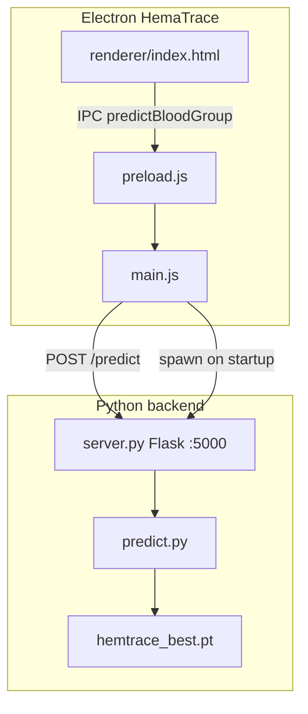

# HemaTrace / Sara Pro — Project Documentation

This document is the **single reference** for project structure, datasets, the PyTorch ML backend, the Electron desktop app, configuration, how to run, evaluation metrics, UI behavior, and known limitations.

**Project root:** auto-detected as the parent of `backend/` (see [`backend/config.py`](backend/config.py) `ROOT`). Optional override: environment variable `HEMATRACE_ROOT`.

**Last updated:** May 2026 (GitHub-ready layout, portable paths, `.gitignore` excludes all datasets).

**Datasets are not in Git** — see [DATA_SETUP.md](DATA_SETUP.md) and [.gitignore](.gitignore).

---

## 1. High-level overview

| Layer | Role |
|--------|------|
| **Python backend** (`backend/`) | Load fingerprint images, train a **4-class** Rh-positive classifier (**A+, B+, AB+, O+**), serve **Flask** HTTP API for inference, save **PyTorch** checkpoints (`.pt`). |
| **HemaTrace** (`HemaTrace/`) | **Electron** desktop app: staff login, patient test workflow, simulated scan UI, prediction via IPC → HTTP; spawns Python `server.py` on launch. |
| **Research notebook** | [`BloodGroup_Complete_Final_(1)_(4) (2) (3).ipynb`](BloodGroup_Complete_Final_(1)_(4)%20(2)%20(3).ipynb) — original **TensorFlow / Colab** pipeline; **not** used at runtime (backend is **PyTorch**). |
| **Datasets** | SecuGen captures under `blood group positives\`; Kaggle Rh± under `Kaggle dataset\` (only **Rh+** folders used for training). |

**Scope:** Research / hospital-style **prototype** — not validated for clinical use. The deployed model predicts **four Rh-positive groups only**.



---

## 2. Directory structure

```
d:\sara pro\
├── .venv\                          # Python virtualenv (torch, flask, opencv, …)
├── requirements.txt
├── PROJECT_DOCUMENTATION.md        # This file
│
├── backend\
│   ├── config.py                   # ROOT, paths, hyperparameters, Flask host/port
│   ├── preprocess.py               # CLAHE, Gabor, 224×224, augmentation
│   ├── dataset.py                  # Developed + Kaggle load, person-aware split
│   ├── model.py                    # HemaTraceNet (EfficientNet-B0)
│   ├── train.py                    # Two-phase training + test evaluation
│   ├── predict.py                  # TTA inference (CLI + library)
│   ├── server.py                   # Flask: /health, /predict
│   ├── evaluate_unseen.py          # Eval on unseen dataset\ per folder
│   ├── models\
│   │   ├── hemtrace_best.pt        # Active checkpoint
│   │   └── hemtrace_best.keras     # Legacy TensorFlow (optional, unused)
│   └── results\
│       ├── classification_report.txt
│       ├── training_history.png
│       ├── confusion_matrix.png
│       └── unseen_evaluation.txt
│
├── HemaTrace\                      # Electron desktop app
│   ├── main.js
│   ├── preload.js
│   ├── package.json
│   ├── renderer\index.html
│   └── assets\icons\
│
├── blood group positives\developed dataset\  # Primary SecuGen data (A+, B+, AB+, O+)
├── Kaggle dataset\dataset_blood_group\
├── unseen dataset\                  # Hold-out eval (see evaluate_unseen.py)
└── BloodGroup_Complete_Final_*.ipynb
```

---

## 3. Data sources

### 3.1 Primary — developed dataset (`blood group positives\developed dataset`)

| Subfolder | Format | Approx. count |
|-----------|--------|---------------|
| `A+` | `.bmp` | 401 |
| `B+` | `.bmp` | 299 |
| `AB+` | `.bmp` | 287 |
| `O+` | `.bmp` | 427 |
| **Total** | | **1414** |

Path: `DEVELOPED_DATA_PATH` in [`config.py`](backend/config.py).

### 3.2 Secondary — Kaggle (`Kaggle dataset\dataset_blood_group`)

| Folder | Approx. files | Used in training |
|--------|---------------|------------------|
| `A+`, `B+`, `AB+`, `O+` | 565 / 652 / 708 / 852 | Yes |
| `A-`, `B-`, `AB-`, `O-` | 1009 / 741 / 761 / 712 | **No** (`KAGGLE_CLASSES` → `None`) |

**Combined Rh+ only (developed + Kaggle):** ~**4191** images before split (exact counts printed by `python dataset.py`).

### 3.3 Loader & split

- **Extensions:** `.bmp`, `.png`, `.jpg`, `.jpeg` (case-insensitive).
- **Preprocess:** every image through [`preprocess_single_image`](backend/preprocess.py); failures skipped.
- **Person-aware split:** `PRINTS_PER_PERSON = 10` — consecutive sorted files = one “person”; **70% / 15% / 15%** train / val / test by person count per class.
- **Train augmentation:** `aug_fraction = 0.40` extra augmented copies (see [`dataset.py`](backend/dataset.py)).

---

## 4. Preprocessing ([`preprocess.py`](backend/preprocess.py))

1. Load grayscale (path, ndarray, or PIL).
2. Portrait fix (rotate if width > height).
3. **CLAHE** (clip 2.0, 8×8 tiles).
4. **Gabor bank** — 8 orientations (0°–157.5°), max response per pixel.
5. Gaussian blur 3×3.
6. Resize **224×224** (Lanczos), normalize to **[0, 1]**.
7. **Augmentation** (train/TTA): ±10° rotations, brightness, ±5% zoom — **no horizontal flip**.

---

## 5. Model & training (PyTorch)

### 5.1 Stack

- **Framework:** PyTorch + torchvision **EfficientNet-B0** (ImageNet weights).
- **Checkpoint:** `backend/models/hemtrace_best.pt` — keys: `model_state_dict`, `val_acc`, `epoch`, `num_classes`.

### 5.2 Architecture ([`model.py`](backend/model.py))

| Part | Detail |
|------|--------|
| Input adapter | `Conv2d(1→3, 1×1)` + `BatchNorm2d` |
| Backbone | `efficientnet_b0` **features** only |
| Pool | Global average pooling |
| Head | BN → Linear 256 → Dropout 0.5 → Linear 128 → Dropout 0.4 → **4** logits |

- **Phase 1:** backbone frozen; train adapter + head (`LR_PHASE1 = 1e-3`, max 20 epochs, patience 10).
- **Phase 2:** last **two** backbone blocks unfrozen (`LR_PHASE2 = 1e-5`, max 80 epochs, patience 15).

### 5.3 Training ([`train.py`](backend/train.py))

- **GPU:** CUDA required unless `HEMATRACE_ALLOW_CPU=1`.
- **Loss:** weighted `CrossEntropyLoss`, label smoothing **0.1**.
- **Optimizer:** AdamW (`weight_decay=1e-4`); `ReduceLROnPlateau` on validation loss.
- **Outputs:** `hemtrace_best.pt`, `training_history.png`, `confusion_matrix.png`, `classification_report.txt`.

### 5.4 Hyperparameters ([`config.py`](backend/config.py))

| Symbol | Value |
|--------|--------|
| `CLASSES` | `['A+', 'B+', 'AB+', 'O+']` |
| `INPUT_SIZE` | `(224, 224)` |
| `BATCH_SIZE` | 32 |
| `EPOCHS` (phase 2) | 80 |
| `SEED` | 42 |
| `TRAIN_RATIO` / `VAL_RATIO` | 0.70 / 0.15 (test = remainder) |
| `SERVER_HOST` / `SERVER_PORT` | `127.0.0.1` / `5000` |

### 5.5 Inference ([`predict.py`](backend/predict.py))

- **TTA:** default **10** augmented views; mean softmax → class + confidence.
- **JSON:** `predicted_class`, `confidence` (0–100), `all_scores`, `error` (`null` on success).
- **Entry points:** `predict_from_path`, `predict_from_bytes` (temp file), CLI `python predict.py <image>`.

### 5.6 Model performance (current checkpoint)

**Held-out test set** ([`backend/results/classification_report.txt`](backend/results/classification_report.txt)):

| Metric | Value |
|--------|--------|
| **Test accuracy** | **58.42%** (659 samples) |
| A+ | P=0.49, R=0.50, F1=0.49 |
| B+ | P=0.59, R=0.58, F1=0.59 |
| AB+ | P=0.58, R=0.62, F1=0.60 |
| O+ | P=0.66, R=0.63, F1=0.64 |

**Unseen folder eval** ([`backend/results/unseen_evaluation.txt`](backend/results/unseen_evaluation.txt), 10× `O+` under `unseen dataset\O+\`):

| Metric | Value |
|--------|--------|
| Accuracy | **30%** (3/10) |
| Note | Low confidence (~34–65%); likely domain shift vs training mix |

Re-run unseen eval:

```powershell
cd "d:\sara pro\backend"
& "..\.venv\Scripts\python.exe" evaluate_unseen.py
```

---

## 6. Flask server ([`server.py`](backend/server.py))

| Endpoint | Method | Body | Response |
|----------|--------|------|----------|
| `/health` | GET | — | `{ "status": "ok", "model_loaded": true }` |
| `/predict` | POST | `multipart/form-data`, field **`image`** | Prediction JSON; HTTP 400/500 on errors |

- Binds **`127.0.0.1:5000`** only (local).
- **CORS:** localhost, `null`, `file://` (Electron).
- **Startup:** `load_model()` in `__main__` — missing `.pt` → process exits.

---

## 7. Electron app ([`HemaTrace/`](HemaTrace/))

### 7.1 Runtime flow

1. `main.js` spawns `d:\sara pro\.venv\Scripts\python.exe` with `backend\server.py`.
2. Polls `GET http://127.0.0.1:5000/health` (up to 30×1s).
3. Opens frameless window → `renderer/index.html`.
4. User flow: **login** → dashboard / new test / records / staff log / admin / about.
5. **Scan:** UI animation (~3.5s); **`showResult()`** sends image bytes via IPC → main posts to `/predict`.
6. **Image source today:** file picker (`.bmp`/`.png`) unless `window._lastFingerprintBytes` is set (reserved for future SecuGen SDK).
7. **Records:** stored in **browser memory only** (lost on app restart).

### 7.2 UI (current)

| Area | Content |
|------|---------|
| Branding | “Non-Invasive Blood Group Detection System” — **no** university/FYP footer or top-bar institution text |
| Login | “Staff Sign In”; name placeholder **“Abdul Rehman”** |
| About | Version 1.0.0, feature cards, exit button — **no** development team or advisor section |
| Sidebar | Product name only (no “UOW · FYP 2025”) |
| Sensor UI | “SecuGen Hamster U20” status is **simulated** (`connectSensor()` after login delay) |

**Model scope:** About page feature card states **4 Rh-positive groups (A+, B+, AB+, O+)**, matching `CLASSES` in `config.py`.

### 7.3 Security model

- `contextIsolation: true`, `nodeIntegration: false`.
- API exposed on loopback only.
- Login is **local/demo** (name + role, no password).

### 7.4 IPC API ([`preload.js`](HemaTrace/preload.js))

```javascript
window.electronAPI = {
  minimize, maximize, close,
  predictBloodGroup(imageArrayBuffer)  // → POST /predict
}
```

---

## 8. How to run

### 8.1 First-time setup

```powershell
cd "d:\sara pro"
python -m venv .venv
.\.venv\Scripts\Activate.ps1
pip install -U pip
pip install -r requirements.txt
```

```powershell
cd "d:\sara pro\HemaTrace"
npm install
```

Ensure `backend\models\hemtrace_best.pt` exists (train or copy checkpoint).

**GPU (optional, for training):**

```powershell
pip uninstall -y torch torchvision
pip install torch torchvision --index-url https://download.pytorch.org/whl/cu124
python -c "import torch; print(torch.cuda.is_available())"
```

Use **venv Python** always: `d:\sara pro\.venv\Scripts\python.exe`.

### 8.2 Option A — Desktop app (backend auto-started)

```powershell
cd "d:\sara pro\HemaTrace"
npm start
```

Equivalent: `npx electron .`

### 8.3 Option B — Separate terminals (backend + frontend)

**Terminal 1 — backend:**

```powershell
cd "d:\sara pro\backend"
& "..\.venv\Scripts\python.exe" server.py
```

**Terminal 2 — frontend:**

```powershell
cd "d:\sara pro\HemaTrace"
npm start
```

> **Note:** `main.js` still spawns a second Python process on Electron launch. If port 5000 is taken, the child may fail while Terminal 1 serves requests. For a single backend instance, disable `startPythonServer()` in `main.js` when using manual startup.

**Health check:**

```powershell
curl http://127.0.0.1:5000/health
```

### 8.4 Common backend commands

| Task | Command (from `backend\`, venv active or `& "..\.venv\Scripts\python.exe"`) |
|------|-------------------------------------------------------------------------------|
| Train | `train.py` (set `$env:HEMATRACE_ALLOW_CPU="1"` for CPU-only) |
| Dataset smoke test | `dataset.py` |
| Model smoke test | `model.py` |
| CLI predict | `predict.py path\to\image.bmp` |
| Unseen evaluation | `evaluate_unseen.py` |
| Unbuffered logs | `$env:PYTHONUNBUFFERED="1"; python train.py` |

**PowerShell tip:** Use `& "..\.venv\Scripts\python.exe" script.py` — the `&` call operator is required when invoking an executable from a quoted path.

### 8.5 Windows installer

[`HemaTrace/package.json`](HemaTrace/package.json) — `electron-builder --win` (NSIS). Bundled `files` include **only** Electron assets; **`backend/`, `.venv`, and `hemtrace_best.pt` are not included** unless you extend the build config.

---

## 9. Environment variables

| Variable | Effect |
|----------|--------|
| `HEMATRACE_ALLOW_CPU` | `1` / `true` / `yes` → allow CPU training without CUDA |
| `PYTHONUNBUFFERED` | `1` → line-buffered stdout for long training |
| `PYTHONUTF8` | `1` → UTF-8 console on Windows (emoji in logs) |

---

## 10. Artifacts on disk

| Path | Status / purpose |
|------|------------------|
| `backend/models/hemtrace_best.pt` | **Required** for inference |
| `backend/models/hemtrace_best.keras` | Legacy; safe to delete if unused |
| `backend/results/classification_report.txt` | Test metrics (~58.42% acc) |
| `backend/results/training_history.png` | Phase 1 + 2 curves |
| `backend/results/confusion_matrix.png` | Test confusion matrix |
| `backend/results/unseen_evaluation.txt` | Unseen folder run log |

Refresh §5.6 after retraining.

---

## 11. Related folders

| Path | Note |
|------|------|
| `unseen dataset\` | Evaluated by `evaluate_unseen.py`; not in training `config.py` |
| `blood group positives\developed dataset\` | Canonical SecuGen training tree |
| `A+\` at repo root | Loose samples; not wired in config |
| `Zips\` | Archives (if any) |

---

## 12. Limitations & known issues

| Topic | Detail |
|-------|--------|
| **Classes** | 4 Rh+ only; Rh− Kaggle folders excluded |
| **Accuracy** | ~58% test; ~30% on small unseen O+ set — not clinical-grade |
| **Person split** | Assumes 10 consecutive files = one person; wrong ordering → leakage |
| **Domain mix** | Developed SecuGen set + Kaggle may hurt generalization on new captures |
| **Sensor** | SecuGen connection is UI simulation; inference uses **file picker** by default |
| **Persistence** | Patient records/sessions are in-memory in Electron only |
| **Paths** | `ROOT` from repo layout or `HEMATRACE_ROOT`; Electron uses relative `../.venv` paths |
| **`/health`** | `model_loaded` is static `true`; does not reflect load failures |
| **Flask** | Development server; single-process, not production WSGI |
| **Notebook** | TensorFlow/MobileNetV2 research path — not deployment source of truth |

---

## 13. Troubleshooting

| Problem | Likely fix |
|---------|------------|
| `The module '.venv' could not be loaded` | Venv is at **project root**, not `backend\`. Use `& "..\.venv\Scripts\python.exe"` from `backend\`. |
| `Unexpected token 'server.py'` | Missing `&` before quoted python path in PowerShell. |
| Electron opens but predict fails | Start backend first; confirm `hemtrace_best.pt` exists and `/health` returns 200. |
| CUDA OOM on GTX 1650 | Lower `BATCH_SIZE` in `config.py` (e.g. 16 or 8). |
| Training refuses CPU | Set `$env:HEMATRACE_ALLOW_CPU="1"`. |

---

## 14. Changelog (documentation & product)

| Date / phase | Change |
|--------------|--------|
| Original | Jupyter + TensorFlow/Keras notebook |
| Backend v1 | `config`, `preprocess`, `dataset`, `model`, `train`, `predict`, Flask `server` |
| Electron v1 | IPC + subprocess + `/predict` |
| Stack migration | TensorFlow → **PyTorch** (`.pt`); `requirements.txt` + CUDA wheels |
| Eval tooling | `evaluate_unseen.py`, `unseen_evaluation.txt` |
| UI cleanup (2026) | Removed university/FYP branding, team & advisor from About; login placeholder **Abdul Rehman** |
| Docs (2026) | Full refresh: run commands, metrics, UI state, separate terminals, troubleshooting |
| GitHub prep (2026) | `.gitignore`, portable `ROOT`, removed `.cursor`/checkpoints, `README.md`, `DATA_SETUP.md` |

---

## 15. Publishing to GitHub

### 15.1 What is excluded (never push)

Enforced by [`.gitignore`](.gitignore):

- All dataset directories (`blood group positives/`, `Kaggle dataset/`, `unseen dataset/`, `Zips/`, `A+/`)
- All `*.bmp` / `*.BMP` files anywhere in the repo
- `.venv/`, `node_modules/`, `.cursor/`, `.ipynb_checkpoints/`, `.env`, `*.keras`

### 15.2 What is included

- `backend/` source, `hemtrace_best.pt` (~17 MB), results text/metrics
- `HemaTrace/` app source (not `node_modules/` or `dist/`)
- `requirements.txt`, `README.md`, `DATA_SETUP.md`, this document

### 15.3 First push (example)

```powershell
cd path\to\repo
git init
git add .
git status   # verify no dataset paths or .venv appear
git commit -m "Initial commit: HemaTrace PyTorch backend and Electron app"
git remote add origin https://github.com/YOUR_USER/YOUR_REPO.git
git branch -M main
git push -u origin main
```

Always run `git status` before commit. If any dataset path appears staged, **do not commit** — fix `.gitignore` first.

---

*Update §5.6 and §10 after each training run.*
