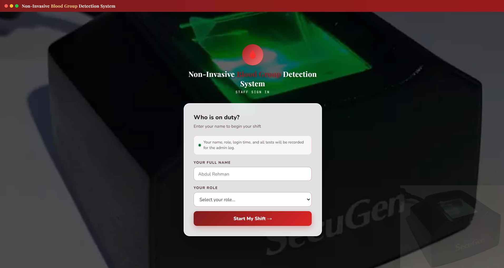
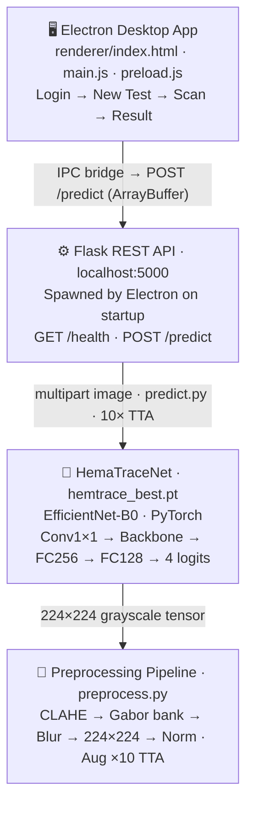

# HemaTrace — Non-Invasive Blood Group Detection System

> **Fingerprint-based ABO/Rh blood group classification** · PyTorch · EfficientNet-B0 · Electron Desktop App

[](https://www.python.org/)
[](https://pytorch.org/)
[](https://www.electronjs.org/)
[](https://flask.palletsprojects.com/)
[]()

---

## What Is HemaTrace?

HemaTrace is a **research-grade desktop system** that classifies a person's Rh-positive blood group (**A+, B+, AB+, O+**) from a fingerprint image — no blood draw required. A custom fingerprint feature pipeline feeds into a fine-tuned **EfficientNet-B0** (PyTorch), served via a **Flask REST API** and wrapped in an **Electron** desktop application with a hospital-style staff workflow.

This project was built as a complete, end-to-end engineering prototype: from raw image preprocessing through model training, evaluation, and a production-style desktop UI.

> ⚠️ **Research prototype only — not validated for clinical diagnosis.**

---
## 🎬 Demo Video

[](https://github.com/user-attachments/assets/e6193001-1a9c-4222-af60-ae373c422179)
## Key Features

- **Custom preprocessing pipeline** — CLAHE contrast enhancement + Gabor filter bank (8 orientations) + Gaussian smoothing, all before the neural network sees a pixel
- **Two-phase transfer learning** — Phase 1 freezes the EfficientNet backbone; Phase 2 selectively unfreezes the last two blocks for domain adaptation
- **Test-Time Augmentation (TTA)** — 10 augmented inference passes averaged for more robust predictions
- **Person-aware train/val/test split** — prevents data leakage across fingerprint captures from the same individual
- **Combined dataset** — 4,191 Rh+ images from a SecuGen capture dataset + Kaggle, balanced across 4 classes
- **Hospital-style Electron UI** — staff login, patient test workflow, simulated SecuGen scanner, result display
- **Flask REST API** — `/health` + `/predict` endpoints, CORS-configured for Electron IPC

---

## System Architecture



---

## Repository Structure

```
.
├── backend/
│   ├── config.py            # Paths, hyperparameters, Flask host/port
│   ├── preprocess.py        # CLAHE, Gabor filter bank, augmentation
│   ├── dataset.py           # Multi-source loader, person-aware split
│   ├── model.py             # HemaTraceNet (EfficientNet-B0)
│   ├── train.py             # Two-phase training + evaluation
│   ├── predict.py           # TTA inference (CLI + library)
│   ├── server.py            # Flask API
│   ├── evaluate_unseen.py   # Hold-out dataset evaluation
│   ├── models/
│   │   └── hemtrace_best.pt # Trained checkpoint (~17 MB)
│   └── results/
│       ├── classification_report.txt
│       ├── confusion_matrix.png
│       └── training_history.png
│
├── HemaTrace/
│   ├── main.js              # Electron main process, spawns Python backend
│   ├── preload.js           # Secure IPC bridge (contextIsolation: true)
│   ├── renderer/index.html  # Full UI (login, dashboard, scan, records)
│   └── package.json
│
├── requirements.txt
├── DATA_SETUP.md            # How to download/place datasets (not in repo)
└── PROJECT_DOCUMENTATION.md # Full technical reference
```

> **Datasets are not included.** See [DATA_SETUP.md](DATA_SETUP.md). `.gitignore` excludes all fingerprint images and dataset folders.

---

## Model Performance

Evaluated on a held-out test set of **659 samples** (person-aware split, unseen during training):

| Class | Precision | Recall | F1 |
|-------|-----------|--------|----|
| A+    | 0.49      | 0.50   | 0.49 |
| B+    | 0.59      | 0.58   | 0.59 |
| AB+   | 0.58      | 0.62   | 0.60 |
| O+    | 0.66      | 0.63   | 0.64 |
| **Overall** | — | — | **58.42% accuracy** |

Additional evaluation on a small unseen O+ hold-out set (10 samples, different capture conditions) yielded **30% accuracy**, indicating domain shift — an expected challenge when mixing SecuGen and Kaggle sources.

> See `backend/results/` for confusion matrix and training curves.

---

## Getting Started

### Prerequisites

- Python 3.10+
- Node.js 18+
- Windows (Electron app paths use `.venv`; backend is cross-platform)
- CUDA GPU recommended for training (tested on GTX 1650)

### 1 — Python Environment

```powershell
cd path\to\HemaTrace-repo
python -m venv .venv
.\.venv\Scripts\Activate.ps1
pip install -U pip
pip install -r requirements.txt
```

**GPU support (optional, for training):**

```powershell
pip uninstall -y torch torchvision
pip install torch torchvision --index-url https://download.pytorch.org/whl/cu124
python -c "import torch; print(torch.cuda.is_available())"
```

### 2 — Desktop App

```powershell
cd HemaTrace
npm install
npm start          # auto-starts Python backend + opens UI
```

### 3 — Backend Only

```powershell
cd backend
& ".\.venv\Scripts\python.exe" server.py
# → http://127.0.0.1:5000/health
```

### 4 — Training From Scratch

Place datasets per [DATA_SETUP.md](DATA_SETUP.md), then:

```powershell
cd backend
python train.py
# CPU-only: $env:HEMATRACE_ALLOW_CPU="1"; python train.py
```

Outputs: `hemtrace_best.pt`, `training_history.png`, `confusion_matrix.png`, `classification_report.txt`

---

## API Reference

| Endpoint | Method | Input | Response |
|----------|--------|-------|----------|
| `/health` | GET | — | `{ "status": "ok", "model_loaded": true }` |
| `/predict` | POST | `multipart/form-data` — field `image` | `{ "predicted_class": "O+", "confidence": 82.4, "all_scores": {...}, "error": null }` |

---

## Tech Stack

| Layer | Technology |
|-------|-----------|
| Deep learning | PyTorch, torchvision (EfficientNet-B0) |
| Image processing | OpenCV, Pillow |
| API server | Flask |
| Desktop shell | Electron (Node.js) |
| Training utilities | scikit-learn, matplotlib, NumPy |

---

## Limitations

- Classifies **4 Rh-positive groups only** (A+, B+, AB+, O+); Rh-negative excluded
- ~58% test accuracy — not clinical-grade; meaningful as a research baseline on this task
- Patient records are in-memory only (lost on app restart)
- SecuGen sensor connection is simulated; inference uses a file picker
- Flask runs as a development server (not production WSGI)

---

## Documentation

Full technical reference (architecture, hyperparameters, training details, troubleshooting) is in [PROJECT_DOCUMENTATION.md](PROJECT_DOCUMENTATION.md).

---

## License & Use

**Research / academic prototype. Not intended for clinical diagnosis or medical use.**
